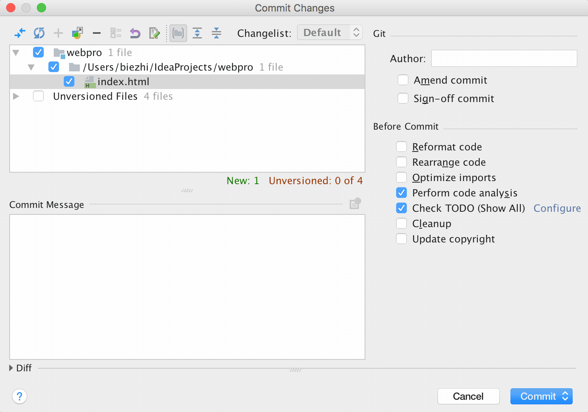

# gitmoji plugin

## Installation

Install directly from the IDE plugin manager (File > Settings > Plugins > Browser repositories > <kbd>gitmoji</kbd>)

Or 

go https://plugins.jetbrains.com/plugin/10315-gitmoji download.

## Usage

- » Input the changes you want to submit the content.
- » [reference commit rules](https://gitmoji.carloscuesta.me)

## Preview

## License

[MIT](LICENSE)